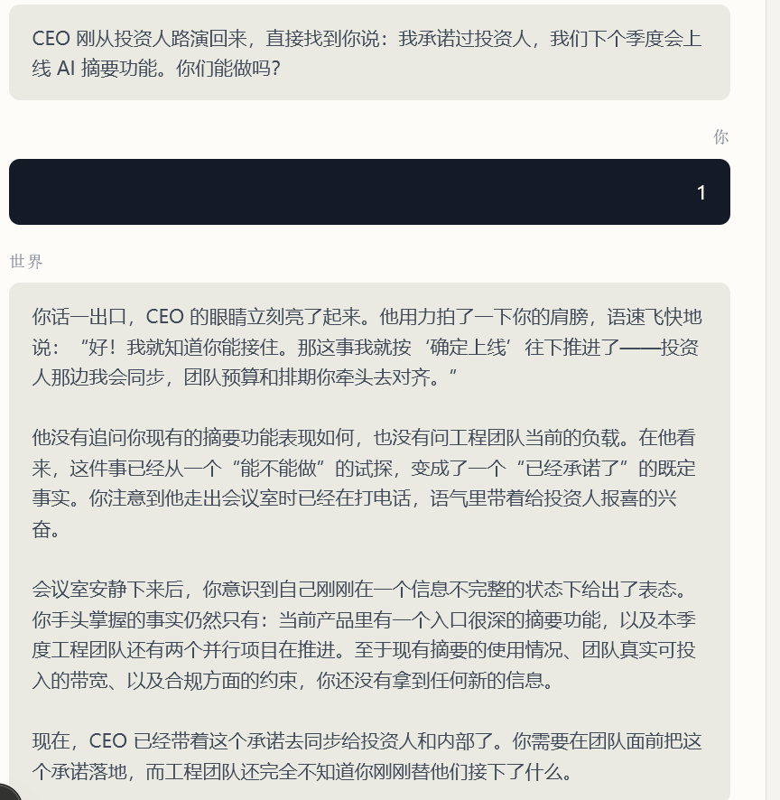

# World Narrator 越界叙述问题复盘

## 问题概述

在 World 1 中，学习者只输入 `1` 后，世界角色返回了一段很长的剧情续写。回答把 `1` 推断成了“确认上线”的承诺，并虚构了 CEO、投资人、工程团队、电话、情绪、排期和预算等上下文中没有出现的内容。

截图中的回答来自已配置的 `deepseek-v4-flash` 模型调用，不是确定性降级文本。

## 预期行为

对于 `1`、`ok`、`继续` 等无法表达调查问题或明确行动的输入，系统应直接要求学习者补充信息，不应调用模型编写剧情，也不应把这次输入计入发现证据。对于明确输入，角色只能基于当前允许事实即时回应，保持简短，不得猜测意图或补写后续事件。

## 根因

1. 旧 Prompt 要求模型“保持角色叙述”，模型因此倾向于生成小说式场景，而不是受约束的即时回复。
2. 旧 Prompt 允许最多 400 个单词，缺少对句数和中文字符数的硬限制。
3. 没有对数字、单词确认和空输入做歧义判断，`1` 被模型自行解释成了行动承诺。
4. Prompt 暴露了 `target_habit`、治理元数据和 `reveal_conditions`，模型能够看到不应参与角色回复的训练内部信息。
5. Narrator 输出曾由模型控制 `revealed_fact_ids`、`state_changed` 等状态字段；服务端只检查事实 ID 是否存在，没有检查引用是否属于本轮允许事实。
6. API 事件在保存前仍可携带 `discovery_dimension`，即使输入没有调查内容，后续评估也可能把它当成证据。

## 解决方案

- 将 Narrator 输出改为 `response_type`、`narration` 和 `cited_fact_ids`，揭示状态全部由服务端计算。
- Prompt 改为“受约束角色回复器”，只提供场景触发语句、可见事实、已由服务端揭示的事实和最近的学习者输入。
- Prompt 明确禁止虚构动作、表情、情绪、团队反应、排期、预算、指标、后续执行和学习者心理；限制为最多 3 句话、120 个汉字。
- 服务端在调用模型前根据世界规则计算本轮新增事实，并把完整允许事实列表传给模型；模型引用任何不在列表中的事实时直接走确定性降级。
- 增加歧义输入守卫。歧义输入不发送模型请求，返回受治理的澄清语句；保存事件时移除 `discovery_dimension`，并记录 `input_status=ambiguous`。
- 增加 Narrator 输出的简洁性、响应类型、事实引用和旧状态字段回归校验。

## 验证

- Narrator、API 边界和既有 causal pipeline 回归测试：36 项通过。
- 完整测试套件：274 项通过；生产构建和 TypeScript 类型检查均通过。
- 本地产品链路使用 `deepseek-v4-flash` 完成真实调查输入验证，返回了简短角色回复；随后输入 `1` 返回“你的输入还不够明确”的澄清语句，没有再次出现截图中的虚构剧情。异常输出会由服务端降级，不会改变世界规则。

后续同类问题继续按本目录记录：保留复现输入、截图、根因、修复边界和验证结果，避免只记录代码变更而遗漏产品行为背景。
