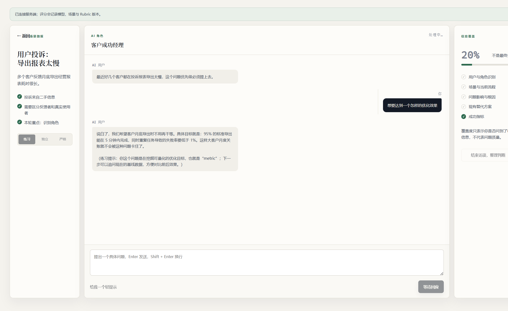
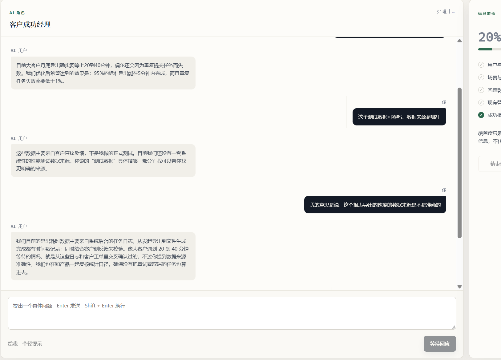
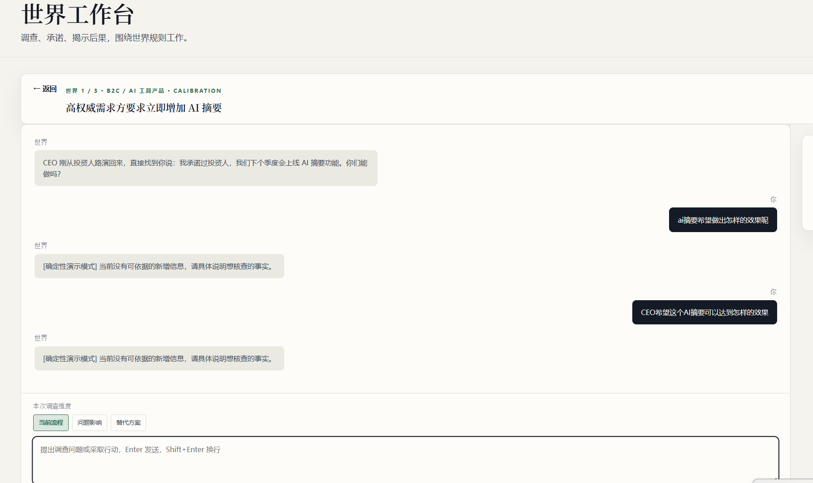
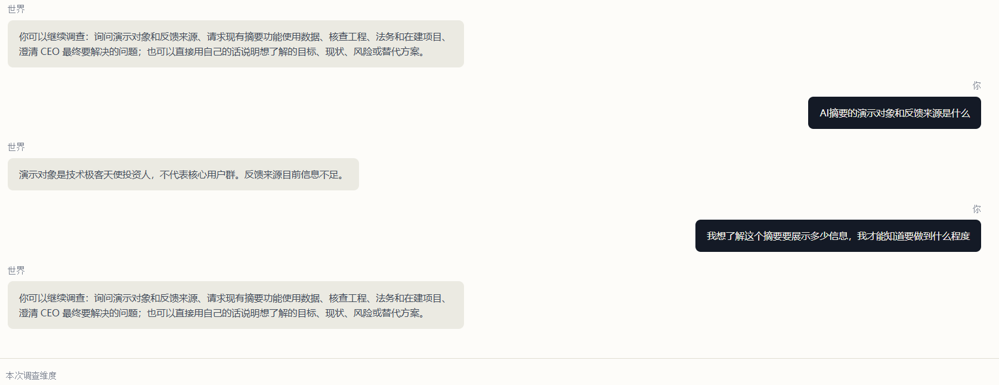

# Product Drill 全项目测试优化清单

> 测试日期：2026-08-04
> 测试环境：`http://127.0.0.1:3000/`
> 测试提交：`9d83e8b fix: size world chat bubbles to content`
> 状态：持续维护（6 项未优化，3 项已优化）

## 1. 文档目的

本文记录完整基础流程测试中发现的产品、评估一致性和自动化测试问题，并持续维护每项问题的处理状态。

- “未优化问题”保留现象、原因、建议和验收标准，作为后续开发依据；
- “已优化问题”保留原始问题、定位原因、解决方式和验证结果，作为可追溯的修复记录；
- 每一项仍可按需要拆分为独立 GitHub Issue。

## 2. 本次测试范围

已完成以下流程：

1. 今日训练：进入场景、访谈、整理判断、提交反馈、局部复练；
2. 训练地图：检查 6 个训练任务入口；
3. 世界工作台：世界 1、世界 2、修正练习、世界 3、闭环完成；
4. 复盘与复练：训练记录、4 条世界决策记录、决策时间线；
5. 我的能力：判断习惯、支持证据、反证、迁移证据和证据回链；
6. 模型接入：确认世界记录显示 `deepseek-v4`，能力证据显示 `deepseek-v4-flash:deepseek-v4`；
7. 工程检查：单元测试、类型检查、构建和完整 E2E 尝试。

工程检查结果：

| 检查项 | 结果 |
| --- | --- |
| `npm.cmd test` | 36 个测试文件、274 项测试通过 |
| `npm.cmd run typecheck` | 通过 |
| `npm.cmd run build` | 通过 |
| `npm.cmd run e2e:run` | 5 分钟内未完成，出现超时和 `EPIPE` |

## 3. 优先级定义

- `P0`：直接影响训练结论正确性或主闭环状态，优先修复；
- `P1`：明显影响可用性、等待体验或交付稳定性；
- `P2`：信息表达不清晰，但不阻塞流程。

### 状态汇总

| 分类 | 编号 | 数量 |
| --- | --- | --- |
| 未优化 | `OPT-001` 至 `OPT-006` | 6 |
| 已优化 | `OPT-007` 至 `OPT-009` | 3 |

## 4. 未优化问题

### OPT-001 P0：调查维度反馈计算错误

状态：未优化。

#### 现象

世界 1 修正练习中只提交了两个调查维度：

- 当前流程；
- 问题影响。

没有调查或引用“替代方案”，但反馈仍显示：

> 涵盖了判断所需的三个维度。

此外，内容为 `1` 的无效调查动作在获得澄清回复后，仍会出现在“引用的调查事件”中并默认选中。

#### 影响

- 学习者会被告知自己已经完成实际未完成的调查；
- 无效输入可能进入决策证据依据；
- 反馈无法可靠指导下一次复练；
- 后续能力画像可能建立在错误维度判断上。

#### 已定位原因

`product-drill-app/src/app/world-workbench.tsx` 的反馈生成只区分“完全没有证据”和“存在至少一条证据”：

```ts
const missingDims = [];
if (!draft.evidence_basis.length) {
  missingDims.push("workflow", "consequence", "alternative");
}
```

只要存在任意证据，`missingDims` 就为空，没有根据调查事件的 `discovery_dimension` 计算实际覆盖维度。

#### 优化建议

1. 在服务端根据被引用事件的 `discovery_dimension` 计算覆盖维度；
2. 只允许有效、可治理的用户调查事件进入证据列表；
3. 澄清、空输入、无维度事件不能作为决策证据；
4. 页面反馈直接使用服务端评估结果，不再单独推断维度。

#### 验收标准

- 分别提交 0、1、2、3 个维度时，反馈准确显示缺失项；
- 无效输入不会出现在可选证据列表；
- 反馈、决策时间线和能力画像显示相同的维度覆盖结果；
- 增加覆盖上述四种情况的单元测试和 E2E 测试。

### OPT-002 P0：反馈结论与能力画像证据类型不一致

状态：未优化。

#### 现象

世界 1 中完成三个调查维度，并提交“先验证用户需求，再决定是否分阶段交付”的判断后：

- 证据反馈显示“具备完整的证据基础”；
- 能力画像却把同一决策归入 `premature_solution_commitment` 的“支持证据”；
- 页面最终仍显示低置信度。

这意味着同一决策在反馈页被判定为完整，在能力画像中却被当成支持“过早承诺”习惯的证据。

#### 影响

- 用户无法判断哪个结论可信；
- 能力画像可能强化与实际行为相反的习惯结论；
- 推荐的下一挑战可能建立在错误证据类型上。

#### 可能原因

当前存在两套结论来源：

1. 前端使用 `buildInterventionContent` 生成自然语言反馈；
2. 服务端使用模型执行行为观察和假设更新，再生成能力证据。

两条链路没有共享同一个受治理的维度结果。模型没有正确引用全部事件时，服务端可能判断缺失维度，而前端仍根据本地表单显示“完整”。

#### 优化建议

1. 将服务端 `BehaviorObservation` 作为唯一评估事实来源；
2. 反馈文案、证据类型和下一挑战全部消费同一份评估结果；
3. 维度覆盖由事件结构确定，模型只负责解释，不允许改变事实分类；
4. 保存评估决策的原因和实际引用事件，便于复核。

#### 验收标准

- 同一决策在反馈、能力画像和时间线中的结论一致；
- 完整覆盖三维度的独立决策不会被错误归类；
- 模型漏引或返回非法事件 ID 时使用受治理的确定性结果；
- 回归测试覆盖 `supporting`、`counter`、`assisted` 和 `transfer` 四种证据类型。

### OPT-003 P0：迁移证据与下一挑战状态冲突

状态：未优化。

#### 现象

世界 3 完成后：

- “我的能力”显示 1 条迁移证据；
- 反馈页同时显示假设置信度为 `low`；
- 页面提示未达到迁移测试门槛，并建议返回世界 1 修正；
- 同一页面又提供“完成闭环，查看判断画像”。

#### 影响

- 用户无法确认自己是否已经完成迁移测试；
- 继续“下一挑战”可能重复进入世界 1 修正练习；
- “已获得迁移证据”和“未达到迁移门槛”在同一状态下互相矛盾。

#### 优化建议

1. 明确区分“假设置信度”和“进入迁移测试的资格”；
2. 已完成迁移世界并产生迁移证据后，进入明确的闭环完成状态；
3. 所有世界完成后，不再由低置信度规则无条件返回世界 1；
4. 若仍需要巩固练习，将其显示为可选推荐，而不是未完成状态。

#### 验收标准

- 产生迁移证据后显示唯一、明确的闭环结果；
- 完成世界 3 后不会自动进入重复修正循环；
- 能力画像、下一挑战和完成按钮对当前状态的描述一致；
- 增加完整的世界 1 → 世界 2 → 修正 → 世界 3 状态机 E2E 测试。

### OPT-004 P1：证据反馈生成时间过长且缺少可恢复状态

状态：未优化。

#### 现象

点击“查看证据反馈”后，多个世界需要约 90 秒以上才能进入反馈页。等待期间：

- 按钮只显示“生成反馈…”并保持禁用；
- 没有阶段进度；
- 没有超时提示；
- 没有取消或重试入口；
- 用户难以判断请求是否仍在运行。

#### 已定位原因

反馈接口会依次执行：

1. `observeBehavior`；
2. `updateHypothesis`；
3. 下一挑战选择。

OpenAI 兼容客户端配置为 20 秒超时和 1 次重试。两个串行模型阶段在超时重试时会显著拉长接口时间。

相关位置：

- `product-drill-app/src/lib/ai/client.ts`；
- `product-drill-app/src/lib/challenge-evaluation.ts`；
- `product-drill-app/src/app/api/challenge-runs/[id]/interventions/route.ts`。

#### 优化建议

1. 设置反馈接口的整体时间预算，而不是只设置单次模型超时；
2. 超过时间预算后使用确定性评估并标明降级状态；
3. 前端显示“观察行为、更新画像、选择下一挑战”等真实阶段；
4. 支持失败后的明确重试，不让按钮永久禁用；
5. 将真实模型慢速测试与日常确定性 E2E 测试分离。

#### 验收标准

- 正常反馈 P95 小于 30 秒；
- 45 秒内必须成功或返回可理解的降级/失败状态；
- 任意网络错误后按钮可重试；
- 用户不会在没有说明的情况下等待超过 30 秒。

### OPT-005 P1：完整 E2E 测试不稳定

状态：未优化。

#### 现象

运行 `npm.cmd run e2e:run` 时，测试在 5 分钟内未完成，外层输出管道最终出现 `EPIPE`。

已观察到的失败类型：

- 多个训练反馈测试等待“系统为什么做出这个判断”超时；
- `world-workbench-demo.spec.ts` 等待反思阶段主按钮超时；
- `training-dialog.spec.ts` 断言旧文本“真正等待报表的是财务分析师”，实际页面为“实际上真正在等报表的是财务分析师”；
- 真实模型响应时间使 UI 测试结果不可预测。

#### 影响

- 无法把完整 E2E 作为可靠的发布门槛；
- 真正的回归问题可能被慢接口和文案波动掩盖；
- 本地与 CI 结果容易不一致。

#### 优化建议

1. 默认 E2E 使用确定性模型或受控 mock；
2. 真实 DeepSeek 测试作为独立、低频的集成测试；
3. 使用稳定的语义状态和 `data-testid`，避免依赖模型的完整自然语言句子；
4. 为长接口设置明确测试超时和失败上下文；
5. 修正已经过时的文本断言。

#### 验收标准

- 确定性 E2E 在 3 分钟内完成；
- 连续运行 3 次结果一致；
- 不再出现 `EPIPE`；
- 真实模型集成测试失败不会掩盖核心 UI 回归结果。

### OPT-006 P2：能力页两类证据统计容易混淆

状态：未优化。

#### 现象

完成 4 条世界决策并生成支持、反证和迁移证据后，能力页下方仍显示：

> 已留下 1 条训练记录，其中 0 条进入正式能力趋势。

该数字只统计“今日训练”记录，不统计世界工作台决策，但页面没有明确说明两个统计体系的边界。

#### 影响

- 用户可能认为刚完成的世界训练没有保存；
- “判断习惯证据”和“五项产品发现能力证据”的关系不清晰。

#### 优化建议

1. 明确命名为“世界判断证据”和“专项训练证据”；
2. 在统计旁说明两类证据的来源和计入规则；
3. 提供统一的总训练记录入口，但保持不同证据体系独立计算。

#### 验收标准

- 用户可以从页面文案判断每个数字统计什么；
- 完成世界工作台后不会误认为记录丢失；
- 两类证据的跳转和追溯入口保持可用。

## 5. 已优化问题

本节保留问题发生时的表现、根因、具体解决方式和验证结果，避免修复完成后失去问题上下文。

### OPT-007 P1：三分钟诊断发送消息缺少即时反馈

状态：已优化，自动化回归通过，待手动确认。

#### 现象

在“开始 3 分钟诊断”的访谈工作台中提交追问后，用户消息要等到大模型返回完整会话后才出现在对话记录里。请求处理期间输入框被清空，按钮只显示“等待回应”，对话区域没有显示刚提交的内容或明确的处理中状态，容易让用户误以为提交失败。

现场截图：



#### 影响

- 用户无法确认追问是否已经提交；
- 模型响应较慢时，页面看起来像没有反应；
- 用户可能重复点击或重复发送相同问题；
- 等待期间缺少可感知的进度反馈。

#### 已定位原因

`product-drill-app/src/app/app-shell.tsx` 的 `sendReply` 在 `sendRemoteMessage` 完成前没有更新会话消息列表，只设置了 `busy` 和清空输入框。服务端返回后才通过 `setSession(result.session)` 一次性写入用户消息和 AI 回复。

#### 已完成修复

- 发送后立即显示待发送的用户消息；
- 在 AI 回复返回前显示“正在思考…”状态，并使用 `role="status"` 和 `aria-live` 告知辅助技术；
- 服务端成功返回或离线降级后清除临时状态，由正式会话消息接管，避免用户消息重复；
- 切换训练模式时清理未完成的临时消息。

#### 验收标准

- 点击“发送追问”后，用户消息立即出现在对话时间线；
- 模型响应期间可见“正在思考…”或同等明确的处理中提示；
- 服务端成功、超时和离线降级三种结果均只保留一条用户消息；
- 等待期间仍禁止重复提交，响应结束后输入框和发送按钮恢复可用；
- 增加覆盖即时显示和等待状态的 UI 回归测试。

### OPT-008 P1：发送新消息后对话列表不会自动定位到底部

状态：已优化，自动化回归通过，待手动确认。

#### 现象

当三分钟诊断的对话内容超过可视区域，需要滚动消息列表时，发送新的用户输入后列表仍停留在原来的滚动位置。用户看不到刚刚发送的消息和后续处理中状态，必须手动拖动滚动条到底部。

现场截图：



#### 影响

- 用户无法立即确认新消息已经进入对话；
- 长对话中容易错过“正在思考…”和最新 AI 回复；
- 用户需要额外操作滚动条，打断连续访谈流程。

#### 已定位原因

`product-drill-app/src/app/app-shell.tsx` 的消息列表没有保留 DOM 引用，也没有在 `session.messages` 或待发送消息变化后更新 `scrollTop`，因此浏览器维持原有滚动位置。

#### 已完成修复

- 为消息列表添加引用；
- 每次正式消息或待发送消息变化后，将滚动位置设置到 `scrollHeight`；
- 发送后立即定位到底部，服务端回复替换临时状态后继续保持在最新消息处。

#### 验收标准

- 对话内容超过可视区域时，发送新问题后消息列表自动定位到底部；
- 用户消息、“正在思考…”和 AI 回复均无需手动拖动滚动条即可看到；
- 服务端成功、超时和离线降级路径的最新消息都保持可见；
- 自动定位不会影响输入框和右侧信息覆盖面板的滚动。

### OPT-009 P1：世界工作台的确定性降级重复返回无新增信息

状态：已优化核心体验，自动化与真实 DeepSeek 接口回归通过；分层展示具体降级原因仍作为后续增强项保留。

#### 现象

在世界 1 中连续询问：

- “AI 摘要希望做出怎样的效果呢”；
- “CEO 希望这个 AI 摘要可以达到怎样的效果”。

工作台两次都返回：

> [确定性演示模式] 当前没有可依据的新增信息，请具体说明想核查的事实。

现场截图：



#### 影响

- 用户提出了语义合理的问题，却无法理解应该怎样改写；
- 重复的通用回复让用户误以为世界工作台无法使用；
- 页面没有说明是上游请求失败、结构化解析失败，还是回答被事实边界校验拒绝；
- 未揭示事实的调查动作仍可能进入后续证据选择，放大 OPT-001 的证据治理问题。

#### 已定位原因

用户看到的文案来自 `product-drill-app/src/lib/ai/causal-pipeline.ts` 的 `deterministicNarration`，它会在以下任一情况发生时启用：

1. 没有可用的模型客户端；
2. 模型请求失败或超时；
3. 结构化响应无法解析；
4. 模型回答违反事实引用、回答类型或长度约束。

当前 `.env.local` 已配置 DeepSeek。实测结果如下：

- `/models` 返回 `200`，并包含当前 `deepseek-v4-flash`；
- 最小 `/responses` JSON Schema 请求返回 `200 completed`，结构化结果可正常解析；
- 使用世界叙述 Schema 请求时，模型仍返回 `200 completed`，但在 JSON 前额外输出 `_type="role_reply", narration, cited_fact_ids.`，不再是纯 JSON，导致 `responses.parse` 解析失败；
- 同一回复还补写了“显著提升产品可见度”等允许事实中不存在的效果描述，即使提取 JSON，也会被事实引用边界校验拒绝。

因此这次降级不是模型未连接，而是 DeepSeek 在复杂世界叙述请求中没有严格遵守结构化输出和事实约束。当前代码会捕获解析或校验错误并统一回退到确定性模式，页面没有显示具体失败阶段。

进入确定性模式后，事实揭示只使用 `userAction.includes(trigger)` 做精确短语匹配。世界 1 当前只识别“向谁演示”“投资人反馈”“现有摘要”“使用率”“在建项目”“工程”“合规”“法务”“最终要解决”“真实诉求”等触发词。“希望达到怎样的效果”没有命中这些短语，因此没有新增事实可返回。

#### 是否属于正常现象

- 从安全和事实治理角度，模型异常时降级且不编造内容是正常保护机制；
- 从产品体验角度，合理的目标澄清问题连续得到同一条无信息回复并不正常，应作为待优化问题处理。

#### 优化建议

1. 分别记录并展示“模型未配置、请求失败、解析失败、事实校验拒绝”等降级原因；
2. 为 DeepSeek 增加提供方适配层，使用其稳定支持的结构化输出方式，并在解析后继续执行事实引用校验；
3. 不要仅通过删除前缀强行接受回复，解析成功后仍必须拒绝模型补写的未授权事实；
4. 为世界规则增加受治理的同义表达映射，例如将“希望达到什么效果、目标是什么”映射到“最终要解决/真实诉求”；
5. 未命中时给出场景内可执行的改写提示，而不是重复通用文案；
6. 没有揭示任何事实的动作默认不进入正式证据选择；
7. 增加 DeepSeek 结构化输出兼容性和事实引用校验的集成测试。

#### 2026-08-05 修复记录

- 移除用户必须完整命中固定触发短语的交互要求，输入会先统一大小写、空白和标点，再按受治理的自然语言同义表达识别调查意图；
- 为三个世界的目标、现状、用户、数据、风险、成本、信息来源和替代方案补充常见自然问法；
- “希望达到什么效果”“希望达到怎样的效果”“目标是什么”“为什么要做”等表达现在可以揭示世界 1 的真实目标事实；
- 模型未配置、解析失败或回答越过事实边界时，系统直接使用已经匹配的受治理事实回答，不再显示“确定性演示模式”技术标签；
- 用户再次询问已经揭示过的事实时仍会得到事实回答，但不会重复记录状态变化；
- 暂时无法判断调查意图时，回复当前世界可执行的调查方向，不再重复“当前没有可依据的新增信息”；
- 事实边界校验保持不变：同义表达只决定哪些既有事实可以揭示，模型仍不能创建、修改或引用未授权事实；
- 已增加单元和失败边界测试，覆盖自然问法、重复询问、模型解析失败回退和未识别意图建议。

#### 2026-08-05 第二轮验证：相关问题仍被公式化处理

用户先询问“AI 摘要的演示对象和反馈来源是什么”，系统能够返回已确认事实；随后询问“我想了解这个摘要要展示多少信息，我才能知道要做到什么程度”，系统却重新展示完整调查菜单。第二个问题是在澄清需求范围和完成标准，与当前世界直接相关，不应被当作未命中或无关输入。

现场截图：



本轮定位到两个叠加原因：

1. 服务端和浏览器回退虽然已支持同义表达，但仍以“是否揭示某条隐藏事实”代替“是否与场景相关”；相关但暂时没有对应隐藏事实的问题会落入统一调查建议；
2. DeepSeek 会在结构化 JSON 前增加简短的字段说明，SDK 的严格解析无法取得 `output_parsed`，使原本可以自然回应的问题再次进入本地模板。

本轮修复：

- 新增场景相关性边界；涉及当前需求、用户、目标、范围、现状、数据、影响、风险、成本、约束或替代方案的输入均视为相关，不要求命中事实揭示短语；
- 相关但信息不足时仍使用 `role_reply`，直接说明尚未确定的内容，并只提出一个针对性澄清问题；
- 只有明显与当前世界无关的内容才返回 `clarification` 和回到场景的提示；
- 重写世界叙述提示词，禁止复述调查菜单和系统规则，要求使用自然、具体的业务对话；
- 为 OpenAI 兼容接口增加带前缀 JSON 的提取适配，提取后继续执行 Schema、事实 ID、相关性和长度校验，不因兼容处理放弃事实边界；
- 服务端与浏览器离线回退共享相同的相关性判断，避免网络状态改变回答规则；
- 增加截图原句、带前缀 JSON、相关输入和无关输入的自动化回归测试。

真实 DeepSeek 接口复测中，截图原句返回正式模型回复（`unofficial=false`）：

> 摘要具体展示多少信息还没最终定，关键看用户最需要从摘要里获得什么。我们目前有个基础摘要，但藏在设置页深处，实际使用情况我这边还没有掌握。你先说说你预期摘要要覆盖哪些信息，我们好对齐范围。

同一接口输入“今天天气怎么样”时会提示该问题与当前场景没有直接关系，并引导用户回到当前需求、用户、使用现状、风险或替代方案。

#### 验收标准

- 合理的同义问题能命中相同的受治理事实；
- 降级时页面能区分具体原因，且不暴露密钥或内部错误细节；
- 同一未命中问题连续提交时，系统提供可操作的改写建议；
- 模型失败时仍不编造世界事实；
- 未揭示事实的动作不会被默认当作有效证据。

## 6. 非产品阻塞项

测试过程中多次出现 Statsig 请求超时：

```text
https://ab.chatgpt.com/v1/rgstr ... Timeout of 10000ms expired
```

该请求来自 Codex 内置浏览器的外部统计服务，没有阻塞 Product Drill 接口，不应计入产品缺陷。

## 7. 未优化问题建议处理顺序

1. 修复 OPT-001，保证调查维度计算正确；
2. 修复 OPT-002，使反馈、能力画像和事件证据使用同一结论；
3. 修复 OPT-003，消除迁移完成状态冲突；
4. 优化 OPT-004，缩短反馈等待并增加降级与重试；
5. 修复 OPT-005，恢复稳定的发布回归测试；
6. 最后处理 OPT-006 的信息表达。

已优化的 `OPT-007` 至 `OPT-009` 不再列入待处理顺序；若回归失败，则重新移入“未优化问题”。

## 8. 完成定义

本清单只有在满足以下条件后才可关闭：

- P0 项全部完成并通过对应自动化测试；
- 世界工作台完整闭环连续执行 3 次结果一致；
- 反馈、时间线和能力画像对同一决策给出一致结论；
- E2E 确定性测试稳定通过；
- 真实 DeepSeek 接口失败时存在明确、可恢复的降级体验。
